# 学生选课管理系统

基于 **Spring Boot + Vue 2 + Element UI + MySQL** 的前后端分离教务演示系统。

> 适合课程设计 / 毕业设计演示。安全能力面向教学场景，生产使用前请阅读 [SECURITY.md](SECURITY.md)。

## 功能

- 学生 / 教师 / 课程 / 公告管理
- 排课、选课、选课限制、成绩管理
- 首页实时统计与快捷入口
- 管理员登录鉴权（BCrypt 密码 + Token）

## 界面预览

### 登录

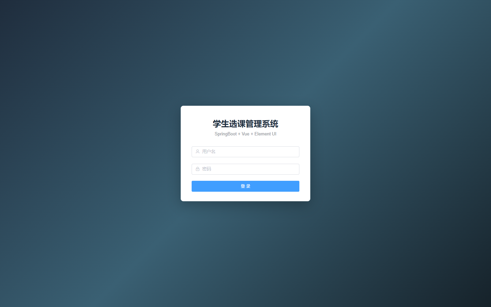

### 首页概览

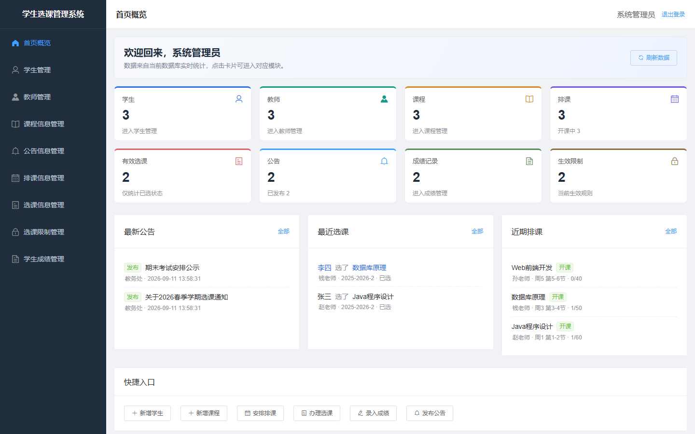

### 学生管理

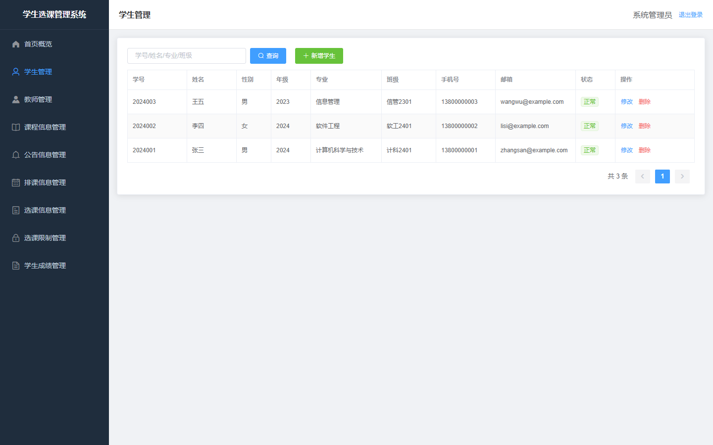

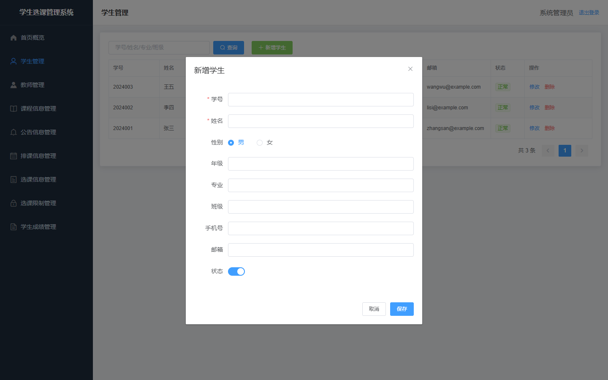

### 教师管理

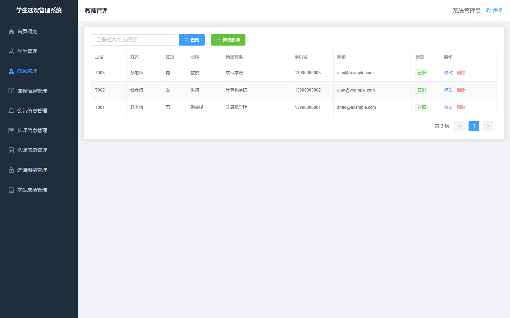

### 课程信息管理

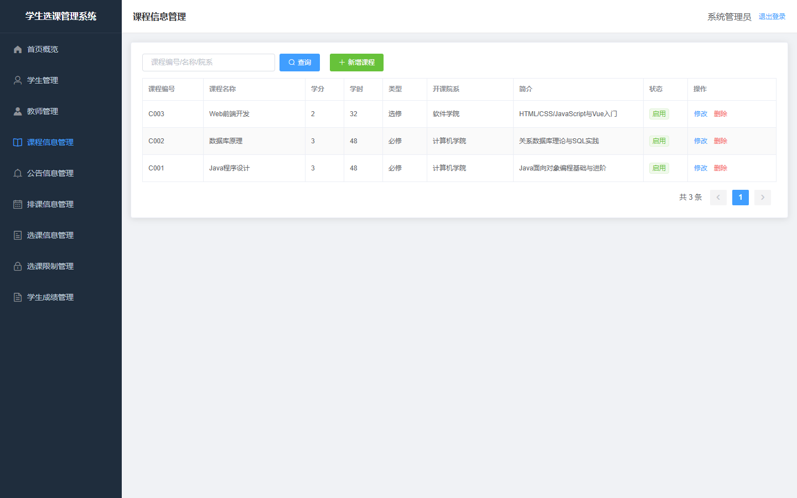

### 公告信息管理

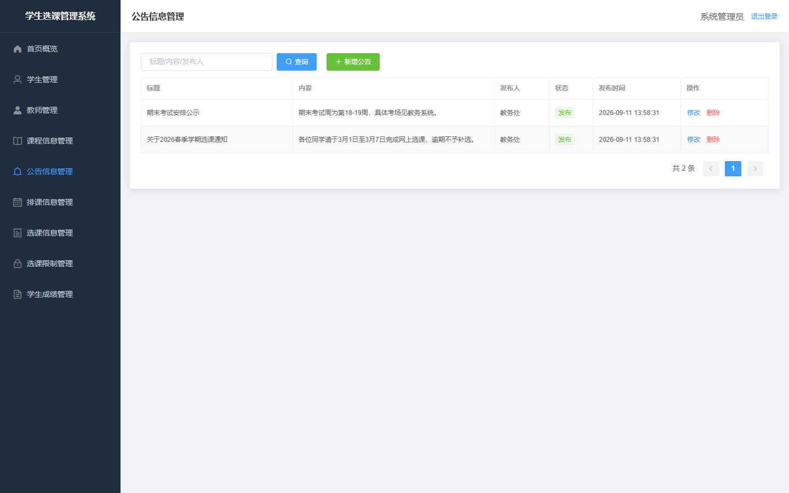

### 排课信息管理

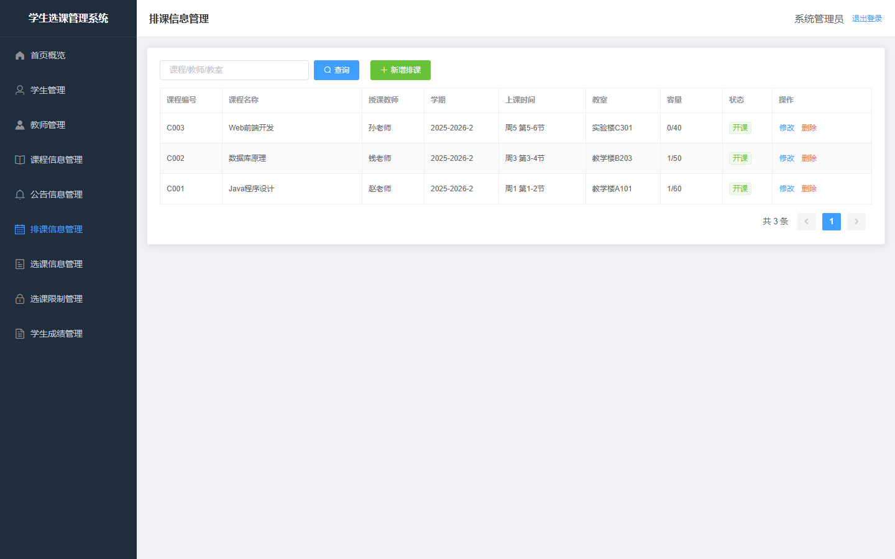

### 选课信息管理

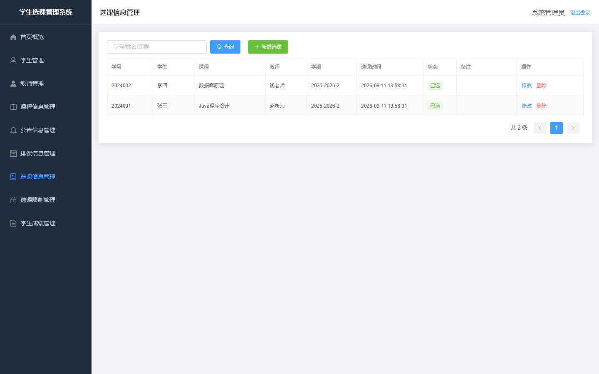

### 选课限制管理

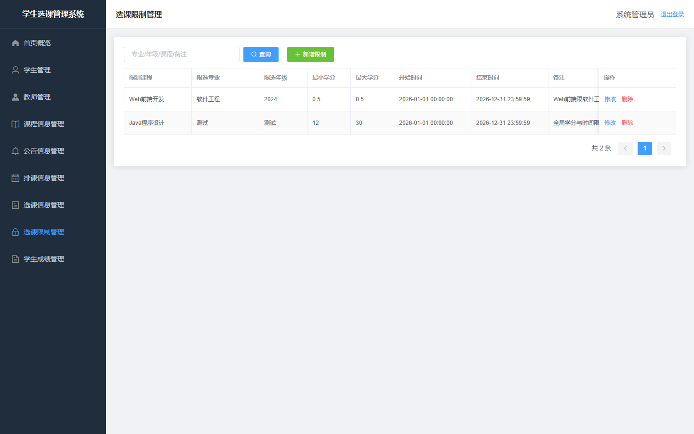

### 学生成绩管理

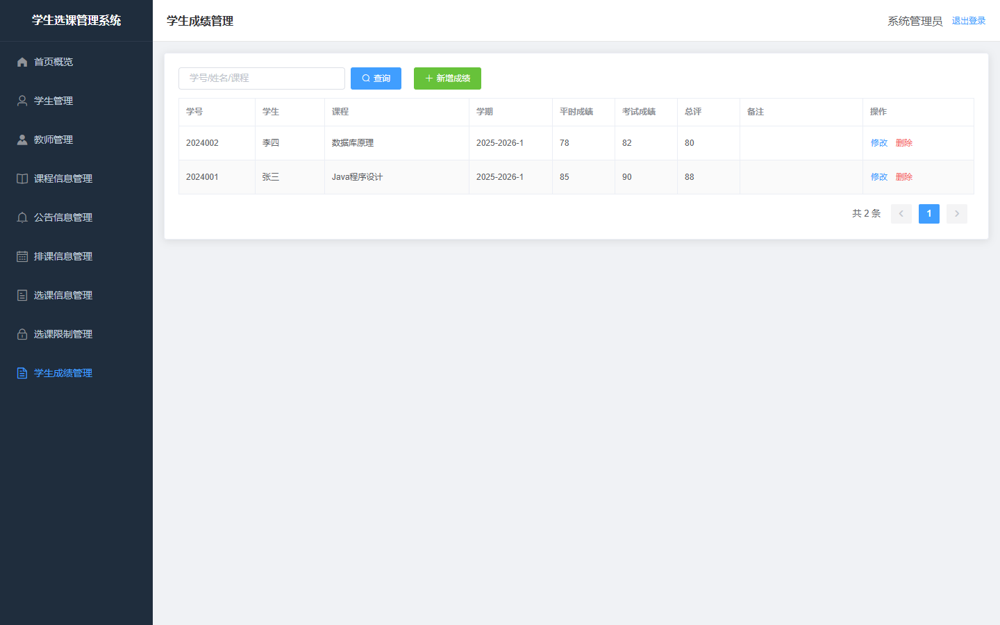

## 技术栈

| 端 | 技术 |
|----|------|
| 前端 | Vue 2.7、Element UI、Vue Router、Axios |
| 后端 | Spring Boot 2.7、MyBatis-Plus |
| 数据库 | MySQL 5.7+ / 8.x |

## 快速开始

### 1. 初始化数据库

使用 UTF-8 导入（推荐）：

```bash
mysql -uroot -p --default-character-set=utf8mb4 < sql/course_selection.sql
```

Windows PowerShell 易把中文弄坏，建议用上面命令或 Python/图形化工具导入。

### 2. 配置后端

```bash
cd backend
cp src/main/resources/application-example.yml src/main/resources/application-local.yml
```

编辑 `application-local.yml`，填入你的 MySQL 账号密码，然后：

```bash
mvn spring-boot:run -Dspring-boot.run.profiles=local
```

或直接改 `application.yml` 中的 `spring.datasource.password`。

默认端口：`8088`，上下文：`/api`。

### 3. 启动前端

```bash
cd frontend
npm install
npm run serve
```

访问：http://localhost:8080

导入官方 SQL 后，可用初始化管理员账号登录（登录页不会展示）：

- 用户名：`admin`
- 密码：`admin123`

## 目录

```text
student-course-system/
├── backend/     # Spring Boot
├── frontend/    # Vue
├── sql/         # 数据库脚本
├── docs/        # 部署文档、设计文档与界面截图
├── SECURITY.md
└── README.md
```

## 文档

- [部署说明](docs/部署说明.md)
- [接口说明](docs/接口说明.md)
- [系统设计文档](docs/系统设计文档.md)
- [安全说明](SECURITY.md)

## License

[MIT](LICENSE)
